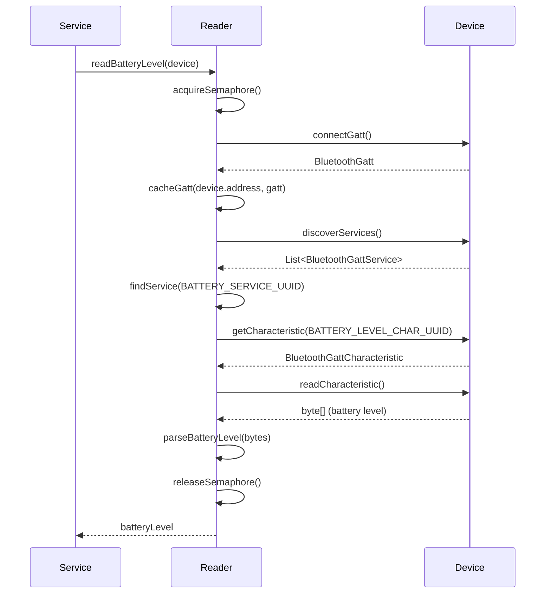
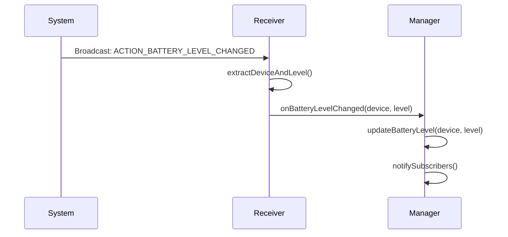
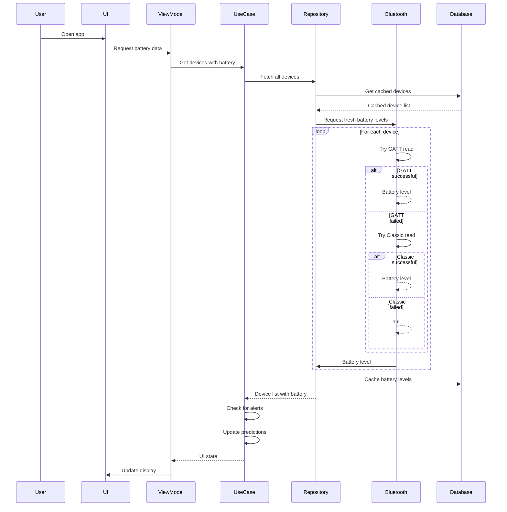
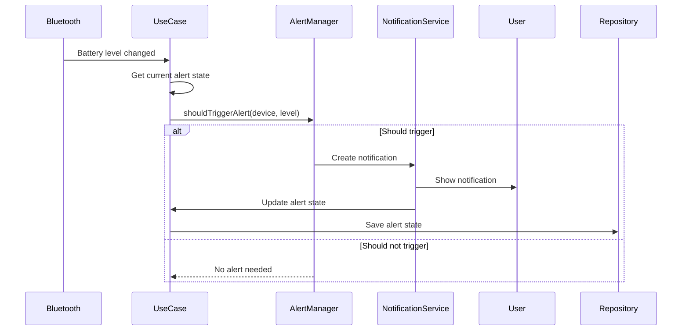
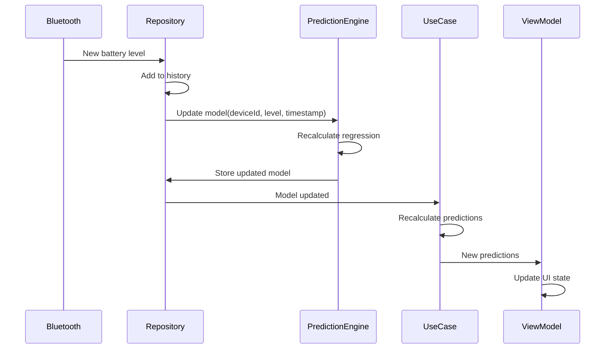
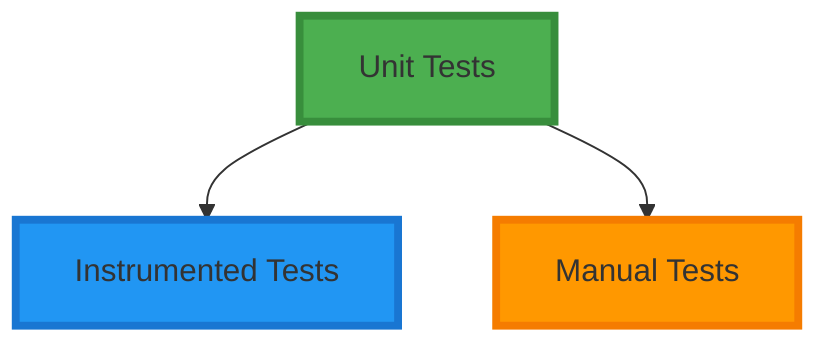

# Battery Guardian - Architecture Overview

**Version:** 1.0.0  
**Last Updated:** August 3, 2026  
**Author:** Peter Andree

---

## Table of Contents

1. [Architecture Principles](#1-architecture-principles)
2. [Layered Architecture](#2-layered-architecture)
3. [Component Architecture](#3-component-architecture)
4. [Bluetooth Integration](#4-bluetooth-integration)
5. [Data Flow](#5-data-flow)
6. [State Management](#6-state-management)
7. [Background Operation](#7-background-operation)
8. [Data Storage](#8-data-storage)
9. [Error Handling](#9-error-handling)
10. [Testing Architecture](#10-testing-architecture)

---

## 1. Architecture Principles

### 1.1 Design Goals

The architecture of Battery Guardian is designed to achieve the following goals:

1. **Separation of Concerns:** Each layer has a single, well-defined responsibility
2. **Testability:** Components can be tested in isolation with minimal mocking
3. **Maintainability:** Changes in one layer have minimal impact on others
4. **Scalability:** New features can be added without affecting existing code
5. **Reliability:** System continues to function correctly in various conditions
6. **Performance:** Efficient use of system resources (battery, memory, CPU)

### 1.2 Architecture Constraints

- **Platform:** Android 8.0+ (API 31+)
- **Language:** Kotlin
- **No Cloud Backend:** All data stored locally on device
- **No LLM/AI:** Uses simple regression algorithms only
- **Background Operation:** Must work reliably when app is closed
- **Battery Efficiency:** Minimal impact on phone battery life

### 1.3 Design Patterns

| Pattern | Usage | Benefit |
|---------|-------|---------|
| **Repository Pattern** | Data access abstraction | Decouples business logic from data sources |
| **Clean Architecture** | Layer separation | Testable, maintainable, independent of frameworks |
| **Dependency Injection** | Component wiring | Testability, loose coupling |
| **State Pattern** | Alert state management | Clean state transitions |
| **Observer Pattern** | Data updates | Reactive UI updates |
| **Strategy Pattern** | Battery reading methods | Flexible, extensible |

---

## 2. Layered Architecture

Battery Guardian follows a **strict layered architecture** with unidirectional dependencies:

```
┌─────────────────────────────────────────────────────────────────────────────┐
│                              UI LAYER                                        │
│  ┌─────────────────────────────────────────────────────────────────────┐  │
│  │  Presentation Layer                                                  │  │
│  │  - Jetpack Compose Screens                                         │  │
│  │  - ViewModels (State holders)                                      │  │
│  │  - Composable Functions                                             │  │
│  │  - Theme and Styling                                                │  │
│  │  - Navigation                                                       │  │
│  └─────────────────────────────────────────────────────────────────────┘  │
└─────────────────────────────────────────────────────────────────────────────┘
                                      │
                                      ▼ (depends on)
┌─────────────────────────────────────────────────────────────────────────────┐
│                              DOMAIN LAYER                                    │
│  ┌─────────────────────────────────────────────────────────────────────┐  │
│  │  Business Logic Layer                                               │  │
│  │  - Use Cases (Business operations)                                  │  │
│  │  - Domain Models (Entities)                                         │  │
│  │  - Repository Interfaces (Contracts)                                │  │
│  │  - Validation Rules                                                  │  │
│  └─────────────────────────────────────────────────────────────────────┘  │
│                                                                         │
│  Pure Kotlin - No Android framework dependencies                         │
└─────────────────────────────────────────────────────────────────────────────┘
                                      │
                                      ▼ (depends on)
┌─────────────────────────────────────────────────────────────────────────────┐
│                              DATA LAYER                                      │
│  ┌─────────────────────────────────────────────────────────────────────┐  │
│  │  Data Access Layer                                                   │  │
│  │  - Repository Implementations                                       │  │
│  │  - Room Database (Local persistence)                                 │  │
│  │  - DataStore Preferences (User settings)                            │  │
│  │  - Bluetooth Data Sources (GATT, Classic)                          │  │
│  └─────────────────────────────────────────────────────────────────────┘  │
└─────────────────────────────────────────────────────────────────────────────┘
                                      │
                                      ▼ (depends on)
┌─────────────────────────────────────────────────────────────────────────────┐
│                           PLATFORM LAYER                                    │
│  ┌─────────────────────────────────────────────────────────────────────┐  │
│  │  Platform Integration Layer                                          │  │
│  │  - Bluetooth API Wrappers                                            │  │
│  │  - Foreground Service                                                │  │
│  │  - Broadcast Receivers                                               │  │
│  │  - AlarmManager / WorkManager                                        │  │
│  │  - BootCompletedReceiver                                              │  │
│  └─────────────────────────────────────────────────────────────────────┘  │
│                                                                         │
│  Android-specific code - Framework dependencies                         │
└─────────────────────────────────────────────────────────────────────────────┘
```

### 2.1 Layering Rules

#### UI Layer Rules

1. **Contains:** Only UI-related code
2. **Depends on:** Domain Layer
3. **Does NOT depend on:** Data Layer or Platform Layer
4. **Technologies:** Jetpack Compose, ViewModel, Navigation Component
5. **Responsibilities:**
   - Display data to users
   - Collect user input
   - Manage navigation
   - Format data for display

#### Domain Layer Rules

1. **Contains:** Business logic and models
2. **Depends on:** Nothing (pure Kotlin)
3. **Does NOT depend on:** Any Android framework classes
4. **Technologies:** Pure Kotlin, Coroutines
5. **Responsibilities:**
   - Define business entities
   - Implement business rules
   - Define data access contracts
   - Validate business logic

#### Data Layer Rules

1. **Contains:** Data access implementations
2. **Depends on:** Domain Layer (interfaces), Platform Layer (Android APIs)
3. **Does NOT depend on:** UI Layer
4. **Technologies:** Room, DataStore, Android Bluetooth API
5. **Responsibilities:**
   - Implement repository interfaces
   - Manage data persistence
   - Handle data access logic
   - Cache data for performance

#### Platform Layer Rules

1. **Contains:** Android-specific code
2. **Depends on:** Data Layer (for persistence)
3. **Does NOT depend on:** UI Layer
4. **Technologies:** Android Bluetooth API, Services, Receivers, AlarmManager
5. **Responsibilities:**
   - Bluetooth communication
   - Background services
   - System event handling
   - Scheduling and alarms

---

## 3. Component Architecture

### 3.1 Monitoring System

The core of Battery Guardian is the **BatteryMonitorService**, a foreground service that provides continuous battery monitoring.

```
┌─────────────────────────────────────────────────────────────────────────────┐
│                        BatteryMonitorService                                  │
│                          (Foreground Service)                                  │
│                                                                             │
│  ┌─────────────────────────────────────────────────────────────────────┐  │
│  │                         COORDINATORS                                    │  │
│  │  ┌─────────────────┐  ┌─────────────────┐  ┌─────────────────┐      │  │
│  │  │ PollingOrchestrator│  │  AlertManager   │  │  DeviceManager  │      │  │
│  │  │ - Interval: 1/5/15│  │ - Hysteresis   │  │ - Discovery     │      │  │
│  │  │   minutes        │  │   (2% band)     │  │ - Tracking      │      │  │
│  │  │ - On-demand scans│  │ - State Machine │  │ - Capabilities  │      │  │
│  │  └─────────────────┘  └─────────────────┘  └─────────────────┘      │  │
│  └─────────────────────────────────────────────────────────────────────┘  │
│                                                                             │
│  ┌─────────────────────────────────────────────────────────────────────┐  │
│  │                         READERS                                        │  │
│  │  ┌─────────────────┐  ┌─────────────────┐  ┌─────────────────┐      │  │
│  │  │  GattBatteryReader│  │ClassicBatteryReader│  │ PredictionEngine│      │  │
│  │  │  - BluetoothGatt  │  │ - BroadcastReceiver│  │ - Linear Regression│  │  │
│  │  │  - Connection    │  │ - EXTRA_BATTERY_ │  │ - Per-device    │      │  │
│  │  │    Cache         │  │   LEVEL         │  │   models        │      │  │
│  │  │  - Semaphore     │  │                 │  │ - Slope/Intercept│      │  │
│  │  │  - Timeout: 5s    │  │                 │  │   calculation   │      │  │
│  │  └─────────────────┘  └─────────────────┘  └─────────────────┘      │  │
│  └─────────────────────────────────────────────────────────────────────┘  │
│                                                                             │
│  ┌─────────────────────────────────────────────────────────────────────┐  │
│  │                      REPOSITORIES                                     │  │
│  │  ┌─────────────────┐  ┌─────────────────┐  ┌─────────────────┐      │  │
│  │  │  DeviceRepository│  │BatteryRepository│  │PreferencesRepository│  │  │
│  │  │  - CRUD          │  │ - History       │  │ - User settings │      │  │
│  │  │  - Filtering     │  │ - Health metrics│  │ - Thresholds    │      │  │
│  │  │  - Search        │  │ - Predictions   │  │ - Polling       │      │  │
│  │  └─────────────────┘  └─────────────────┘  └─────────────────┘      │  │
│  └─────────────────────────────────────────────────────────────────────┘  │
│                                                                             │
└─────────────────────────────────────────────────────────────────────────────┘
```

### 3.2 Component Descriptions

#### BatteryMonitorService

**Type:** Foreground Service  
**Purpose:** Continuous battery monitoring and alert management  
**Responsibilities:**
- Manage the lifecycle of monitoring components
- Coordinate between readers, predictors, and alert managers
- Maintain foreground notification
- Handle system events (reboot, Bluetooth state changes)

**Key Methods:**
```kotlin
class BatteryMonitorService : Service() {
    fun startMonitoring()
    fun stopMonitoring()
    fun refreshDevices()
    fun handleDeviceConnected(device: BluetoothDevice)
    fun handleDeviceDisconnected(device: BluetoothDevice)
    fun handleBatteryLevelChanged(deviceId: String, level: Int)
}
```

#### PollingOrchestrator

**Type:** Service Component  
**Purpose:** Manage periodic battery level polling  
**Responsibilities:**
- Schedule periodic battery checks
- Trigger on-demand scans
- Coordinate between multiple readers
- Handle polling interval changes

**Configuration:**
- Default interval: 5 minutes
- Configurable: 1, 5, or 15 minutes
- Adaptive: Can adjust based on device activity

#### GattBatteryReader

**Type:** Battery Reader (BLE)  
**Purpose:** Read battery levels from BLE devices using GATT protocol  
**Responsibilities:**
- Discover devices with Battery Service
- Connect to devices via BluetoothGatt
- Read Battery Level Characteristic
- Read Charging State Characteristics
- Cache connections for performance
- Handle concurrent reads with semaphore
- Implement timeout for each read operation

**UUIDs Used:**
- Battery Service: `0000180f-0000-1000-8000-00805f9b34fb`
- Battery Level Characteristic: `00002a19-0000-1000-8000-00805f9b34fb`
- Battery Status Characteristic: `00002bea-0000-1000-8000-00805f9b34fb`
- Battery Power State Characteristic: `00002a1b-0000-1000-8000-00805f9b34fb`

**Concurrency:**
- Maximum concurrent reads: 3
- Timeout per device: 5 seconds
- Connection cache size: Unlimited (cleared on failure)

#### ClassicBatteryReader

**Type:** Battery Reader (Classic Bluetooth)  
**Purpose:** Read battery levels from Classic Bluetooth devices  
**Responsibilities:**
- Register for battery level change broadcasts
- Extract battery level from intent extras
- Maintain map of device addresses to battery levels
- Handle broadcast receiver lifecycle

**Broadcast:**
- Action: `BluetoothDevice.ACTION_BATTERY_LEVEL_CHANGED`
- Extra: `BluetoothDevice.EXTRA_BATTERY_LEVEL` (int, 0-100)

#### BatteryPredictionEngine

**Type:** Prediction Engine  
**Purpose:** Predict when devices will reach battery milestones  
**Responsibilities:**
- Maintain regression models for each device
- Calculate drain rate (slope) and initial level (intercept)
- Predict time to next milestone (20%, 10%, 5%)
- Calculate confidence in predictions
- Handle edge cases (no drain, charging, erratic data)
- Update models as new data arrives

**Algorithm:** Simple Linear Regression

**Model Parameters:**
```kotlin
data class RegressionModel(
    val slope: Float,       // %/hour (negative when discharging)
    val intercept: Float,   // Theoretical 100% time
    val lastUpdated: Instant,
    val sampleCount: Int,
    val variance: Float
)
```

**Prediction Calculation:**
```kotlin
fun predictTimeToMilestone(model: RegressionModel, milestone: Int): Instant? {
    if (model.slope >= 0) return null // Device not discharging
    
    val hoursToMilestone = (milestone - model.intercept) / model.slope
    return Instant.now().plus(Duration.ofHours(hoursToMilestone.toLong()))
}
```

#### AlertManager

**Type:** Alert Management  
**Purpose:** Manage battery level alerts and notifications  
**Responsibilities:**
- Track alert state for each device (Normal, Low, High)
- Implement hysteresis to prevent notification spam
- Dispatch notifications to user
- Respect user's Do Not Disturb settings
- Group notifications for multiple devices

**Hysteresis Implementation:**
```kotlin
class AlertManager(
    private val hysteresisBand: Int = 2
) {
    fun shouldTriggerLowAlert(
        deviceId: String,
        currentLevel: Int,
        previousState: AlertState
    ): Boolean {
        return when (previousState) {
            AlertState.NORMAL -> currentLevel <= threshold
            AlertState.LOW -> currentLevel < previousLevel // Dropped further
            else -> false
        }
    }
    
    fun shouldClearLowAlert(
        currentLevel: Int,
        threshold: Int
    ): Boolean {
        return currentLevel > threshold + hysteresisBand
    }
}
```

#### DeviceManager

**Type:** Device Management  
**Purpose:** Manage device discovery, tracking, and capabilities  
**Responsibilities:**
- Discover paired Bluetooth devices
- Track connection state of each device
- Cache device capabilities (which reading methods work)
- Classify devices by type
- Handle device renaming
- Manage ignored devices list

**Device Classification:**
```kotlin
enum class DeviceType {
    HEADPHONES,
    SPEAKER,
    SMARTWATCH,
    KEYBOARD,
    MOUSE,
    GAME_CONTROLLER,
    HEARING_AID,
    MEDICAL_DEVICE,
    OTHER
}

class DeviceClassifier {
    private val classificationRules = mapOf(
        "airpods" to DeviceType.HEADPHONES,
        "galaxy buds" to DeviceType.HEADPHONES,
        "wh-1000" to DeviceType.HEADPHONES,
        "jbl" to DeviceType.SPEAKER,
        "bose" to DeviceType.SPEAKER,
        "sonos" to DeviceType.SPEAKER,
        "galaxy watch" to DeviceType.SMARTWATCH,
        "apple watch" to DeviceType.SMARTWATCH,
        // ... more rules
    )
    
    fun classify(deviceName: String): DeviceType {
        val lowerName = deviceName.lowercase()
        return classificationRules.entries
            .firstOrNull { lowerName.contains(it.key) }
            ?.value ?: DeviceType.OTHER
    }
}
```

### 3.3 Repository Components

#### DeviceRepository

**Type:** Repository Implementation  
**Purpose:** Manage device data access  
**Responsibilities:**
- CRUD operations for devices
- Query devices by various criteria
- Track device monitoring status
- Manage ignored devices list

**Interface:**
```kotlin
interface DeviceRepository {
    fun getAllDevices(): Flow<List<Device>>
    fun getDevice(deviceId: String): Flow<Device?>
    fun getMonitoredDevices(): Flow<List<Device>>
    fun getIgnoredDevices(): Flow<List<Device>>
    fun updateDevice(device: Device)
    fun setMonitored(deviceId: String, monitored: Boolean)
    fun setIgnored(deviceId: String, ignored: Boolean)
    fun renameDevice(deviceId: String, newName: String)
}
```

#### BatteryRepository

**Type:** Repository Implementation  
**Purpose:** Manage battery level data access  
**Responsibilities:**
- Store and retrieve battery level history
- Calculate battery health metrics
- Manage prediction data
- Clean up old data

**Interface:**
```kotlin
interface BatteryRepository {
    fun getBatteryHistory(
        deviceId: String,
        startTime: Instant,
        endTime: Instant
    ): Flow<List<BatteryLevel>>
    
    fun getLatestBatteryLevel(deviceId: String): Flow<BatteryLevel?>
    fun addBatteryLevel(level: BatteryLevel)
    fun getBatteryHealth(deviceId: String): Flow<BatteryHealth?>
    fun getPredictions(deviceId: String): Flow<List<BatteryPrediction>>
    fun cleanupOldData(days: Int)
}
```

#### UserPreferencesRepository

**Type:** Repository Implementation  
**Purpose:** Manage user preferences  
**Responsibilities:**
- Store and retrieve user settings
- Provide default values
- Handle preference changes

**Interface:**
```kotlin
interface UserPreferencesRepository {
    val preferences: Flow<UserPreferences>
    
    suspend fun setLowThreshold(percent: Int)
    suspend fun setMediumThreshold(percent: Int)
    suspend fun setCriticalThreshold(percent: Int)
    suspend fun setHysteresisBand(percent: Int)
    suspend fun setPollingInterval(minutes: Int)
    suspend fun setNotificationsEnabled(enabled: Boolean)
    suspend fun setNotificationPriority(priority: NotificationPriority)
    suspend fun setDarkTheme(enabled: Boolean)
    suspend fun setBatteryDisplayFormat(format: BatteryDisplayFormat)
}

data class UserPreferences(
    val lowThreshold: Int = 20,
    val mediumThreshold: Int = 10,
    val criticalThreshold: Int = 5,
    val hysteresisBand: Int = 2,
    val pollingInterval: Int = 5,
    val notificationsEnabled: Boolean = true,
    val notificationPriority: NotificationPriority = NotificationPriority.DEFAULT,
    val darkTheme: Boolean = false,
    val batteryDisplayFormat: BatteryDisplayFormat = BatteryDisplayFormat.PERCENTAGE
)

enum class NotificationPriority {
    LOW, DEFAULT, HIGH, URGENT
}

enum class BatteryDisplayFormat {
    PERCENTAGE, ICON, BOTH
}
```

---

## 4. Bluetooth Integration

### 4.1 Bluetooth Stack Overview

```
┌─────────────────────────────────────────────────────────────┐
│                     Bluetooth API Layer                         │
├─────────────────────────────────────────────────────────────┤
│                                                               │
│  ┌─────────────────┐  ┌─────────────────┐                     │
│  │  BLE (Bluetooth  │  │ Classic Bluetooth │                     │
│  │    Low Energy)    │  │                 │                     │
│  │                  │  │                 │                     │
│  │  - BluetoothGatt │  │ - BluetoothDevice│                     │
│  │  - GattServer    │  │ - Broadcasts     │                     │
│  │  - GattService   │  │ - EXTRA_BATTERY_ │                     │
│  │  - GattCharacteristic││   LEVEL         │                     │
│  └─────────────────┘  └─────────────────┘                     │
│                          │                                         │
│                          ▼                                         │
│  ┌─────────────────────────────────────────────────────┐    │
│  │              Battery Guardian Layer                   │    │
│  │  ┌─────────────────┐  ┌─────────────────┐                │    │
│  │  │  GattBatteryReader│  │ClassicBatteryReader│                │    │
│  │  │                  │  │                 │                │    │
│  │  │ - UUID 0x180F    │  │ - BroadcastReceiver│                │    │
│  │  │ - UUID 0x2A19    │  │ - EXTRA_BATTERY_LEVEL│                │    │
│  │  │ - Connection     │  │                 │                │    │
│  │  │   Management     │  │                 │                │    │
│  │  └─────────────────┘  └─────────────────┘                │    │
│  └─────────────────────────────────────────────────────┘    │
│                                                               │
└─────────────────────────────────────────────────────────────┘
```

### 4.2 GATT Battery Reading

**Process:**



**Error Handling:**
- Connection timeout (5 seconds)
- Service not found
- Characteristic not found
- Read failure
- Device disconnected

**Fallback Strategy:**
1. Try GATT Battery Service
2. If fails, try Classic Bluetooth broadcast
3. If both fail, use last known value (if recent)
4. If no recent value, show "Unknown"

### 4.3 Classic Bluetooth Reading

**Process:**



**Limitations:**
- Only works for devices that report battery level to Android system
- Updates may be infrequent
- No charging state information
- No historical data

### 4.4 Device Capability Detection

The app automatically detects which battery reading method works for each device:

```kotlin
class DeviceCapabilityDetector(
    private val gattReader: GattBatteryReader,
    private val classicReader: ClassicBatteryReader
) {
    suspend fun detectCapabilities(device: BluetoothDevice): DeviceCapabilities {
        val gattSupported = try {
            gattReader.testRead(device) != null
        } catch (e: Exception) {
            false
        }
        
        val classicSupported = classicReader.isDeviceSupported(device.address)
        
        return DeviceCapabilities(
            deviceId = device.address,
            supportsGattBattery = gattSupported,
            supportsClassicBattery = classicSupported,
            preferredMethod = if (gattSupported) BatteryReadMethod.GATT 
                            else if (classicSupported) BatteryReadMethod.CLASSIC 
                            else BatteryReadMethod.NONE
        )
    }
}

data class DeviceCapabilities(
    val deviceId: String,
    val supportsGattBattery: Boolean,
    val supportsClassicBattery: Boolean,
    val preferredMethod: BatteryReadMethod
)

enum class BatteryReadMethod {
    GATT, CLASSIC, MANUAL, NONE
}
```

### 4.5 Bluetooth Permissions

**Required Permissions:**

```xml
<!-- AndroidManifest.xml -->
<uses-permission android:name="android.permission.BLUETOOTH" />
<uses-permission android:name="android.permission.BLUETOOTH_ADMIN" />
<uses-permission android:name="android.permission.BLUETOOTH_CONNECT" />
<uses-permission android:name="android.permission.ACCESS_FINE_LOCATION" />
```

**Runtime Requests:**
- `BLUETOOTH_CONNECT` (Android 12+)
- `ACCESS_FINE_LOCATION` (Android 12+, required for scanning)

**Permission Handling:**
```kotlin
class BluetoothPermissionManager(private val context: Context) {
    fun checkAndRequestPermissions(activity: Activity) {
        val permissionsToRequest = mutableListOf<String>()
        
        if (Build.VERSION.SDK_INT >= Build.VERSION_CODES.S) {
            if (ContextCompat.checkSelfPermission(
                    context, 
                    Manifest.permission.BLUETOOTH_CONNECT
                ) != PackageManager.PERMISSION_GRANTED
            ) {
                permissionsToRequest.add(Manifest.permission.BLUETOOTH_CONNECT)
            }
        }
        
        if (Build.VERSION.SDK_INT >= Build.VERSION_CODES.S) {
            if (ContextCompat.checkSelfPermission(
                    context,
                    Manifest.permission.ACCESS_FINE_LOCATION
                ) != PackageManager.PERMISSION_GRANTED
            ) {
                permissionsToRequest.add(Manifest.permission.ACCESS_FINE_LOCATION)
            }
        }
        
        if (permissionsToRequest.isNotEmpty()) {
            ActivityCompat.requestPermissions(
                activity,
                permissionsToRequest.toTypedArray(),
                REQUEST_CODE_BLUETOOTH_PERMISSIONS
            )
        }
    }
}
```

---

## 5. Data Flow

### 5.1 Main Data Flow



### 5.2 Alert Data Flow



### 5.3 Prediction Data Flow



---

## 6. State Management

### 6.1 Alert State Machine

```mermaid
stateDiagram-v2
    [*] --> NORMAL
    
    NORMAL --> LOW: battery ≤ threshold
    LOW --> NORMAL: battery > threshold + hysteresis
    LOW --> LOW: battery drops further
    
    state NORMAL {
        [*] --> Checking
        Checking --> NORMAL: All batteries above thresholds
    }
    
    state LOW {
        [*] --> Alerting
        Alerting --> LOW: Alert sent
    }
    
    note right of NORMAL
        Hysteresis band: 2%
        Example: For 20% threshold,
        clear when > 22%
    end note
```

**State Definitions:**

| State | Description | Entry Condition | Exit Condition |
|-------|-------------|-----------------|----------------|
| NORMAL | Battery level above all thresholds | Initial state, or battery recovers | Battery ≤ threshold |
| LOW | Battery level at or below a threshold | Battery ≤ threshold | Battery > threshold + hysteresis |

**Hysteresis Implementation:**

```kotlin
class AlertStateMachine(private val hysteresisBand: Int = 2) {
    private val states = mutableMapOf<String, AlertState>()
    
    fun transition(deviceId: String, newLevel: Int, thresholds: List<Int>): AlertState {
        val currentState = states[deviceId] ?: AlertState.NORMAL
        val lowestThreshold = thresholds.minOrNull() ?: 20
        
        return when (currentState) {
            AlertState.NORMAL -> {
                if (newLevel <= lowestThreshold) {
                    states[deviceId] = AlertState.LOW
                    AlertState.LOW
                } else {
                    AlertState.NORMAL
                }
            }
            AlertState.LOW -> {
                if (newLevel > lowestThreshold + hysteresisBand) {
                    states[deviceId] = AlertState.NORMAL
                    AlertState.NORMAL
                } else {
                    AlertState.LOW
                }
            }
        }
    }
    
    fun getCurrentState(deviceId: String): AlertState {
        return states[deviceId] ?: AlertState.NORMAL
    }
}

enum class AlertState {
    NORMAL,
    LOW
}
```

### 6.2 Battery Level State

Each device maintains its battery level state:

```kotlin
data class DeviceBatteryState(
    val deviceId: String,
    val currentLevel: Int?,           // 0-100, null if unknown
    val previousLevel: Int?,         // Previous known level
    val trend: BatteryTrend,         // Direction of change
    val isCharging: Boolean?,        // Currently charging
    val isConnected: Boolean,        // Currently connected
    val lastUpdated: Instant?,       // When last updated
    val alertState: AlertState        // Current alert state
)

enum class BatteryTrend {
    RISING,      // Battery level increasing (charging)
    FALLING,     // Battery level decreasing (discharging)
    STABLE,      // Battery level unchanged
    UNKNOWN      // Not enough data
}
```

### 6.3 Application State

The app maintains global state:

```kotlin
data class AppState(
    val isMonitoring: Boolean,        // Whether monitoring is active
    val isInitialized: Boolean,        // Whether app is initialized
    val devices: List<DeviceBatteryState>,  // All monitored devices
    val hasBluetoothPermission: Boolean,
    val hasNotificationPermission: Boolean,
    val hasBatteryOptimizationExemption: Boolean,
    val lastError: ErrorState?         // Last error encountered
)

data class ErrorState(
    val type: ErrorType,
    val message: String,
    val timestamp: Instant,
    val deviceId: String?
)

enum class ErrorType {
    BLUETOOTH_PERMISSION_DENIED,
    NOTIFICATION_PERMISSION_DENIED,
    BLUETOOTH_DISABLED,
    LOCATION_DISABLED,
    DEVICE_CONNECTION_FAILED,
    BATTERY_READ_FAILED,
    UNKNOWN
}
```

---

## 7. Background Operation

### 7.1 Foreground Service

The app uses a **Foreground Service** to ensure continuous monitoring:

```kotlin
class BatteryMonitorService : Service() {
    private lateinit var notificationManager: NotificationManager
    private lateinit var batteryMonitor: BatteryMonitor
    
    override fun onCreate() {
        super.onCreate()
        notificationManager = getSystemService(NOTIFICATION_SERVICE) as NotificationManager
        createNotificationChannel()
        batteryMonitor = BatteryMonitor(applicationContext)
    }
    
    override fun onStartCommand(intent: Intent?, flags: Int, startId: Int): Int {
        startForeground(NOTIFICATION_ID, createNotification())
        batteryMonitor.start()
        return START_STICKY
    }
    
    override fun onDestroy() {
        batteryMonitor.stop()
        super.onDestroy()
    }
    
    private fun createNotification(): Notification {
        return NotificationCompat.Builder(this, CHANNEL_ID)
            .setContentTitle("Battery Guardian")
            .setContentText("Monitoring Bluetooth device batteries")
            .setSmallIcon(R.drawable.ic_notification)
            .setPriority(NotificationCompat.PRIORITY_LOW)
            .setOngoing(true)
            .build()
    }
    
    private fun createNotificationChannel() {
        if (Build.VERSION.SDK_INT >= Build.VERSION_CODES.O) {
            val channel = NotificationChannel(
                CHANNEL_ID,
                "Battery Monitoring",
                NotificationManager.IMPORTANCE_LOW
            )
            notificationManager.createNotificationChannel(channel)
        }
    }
    
    companion object {
        private const val CHANNEL_ID = "battery_guardian_monitoring"
        private const val NOTIFICATION_ID = 1
    }
}
```

### 7.2 Scheduling Mechanisms

The app uses multiple scheduling mechanisms for different purposes:

| Mechanism | Purpose | Frequency | Wake Device? |
|-----------|---------|-----------|--------------|
| Foreground Service | Continuous monitoring | Always running | No |
| AlarmManager | Critical alerts | As needed | Yes |
| WorkManager | Periodic polling | Configurable | No |

**AlarmManager Usage:**
- Used for critical alerts (e.g., 5% battery)
- Uses `setAlarmClock()` to ensure device wakes up
- Respects Do Not Disturb settings

**WorkManager Usage:**
- Used for periodic battery polling
- Configurable interval (1, 5, or 15 minutes)
- Respects battery optimization settings
- Uses constraints (network, battery, etc.)

### 7.3 Boot Completed Handling

The app automatically restarts monitoring after device reboot:

```kotlin
class BootCompletedReceiver : BroadcastReceiver() {
    override fun onReceive(context: Context, intent: Intent) {
        if (intent.action == Intent.ACTION_BOOT_COMPLETED) {
            val serviceIntent = Intent(context, BatteryMonitorService::class.java)
            if (Build.VERSION.SDK_INT >= Build.VERSION_CODES.O) {
                context.startForegroundService(serviceIntent)
            } else {
                context.startService(serviceIntent)
            }
        }
    }
}
```

**Manifest Registration:**
```xml
<receiver android:name=".monitoring.BootCompletedReceiver">
    <intent-filter>
        <action android:name="android.intent.action.BOOT_COMPLETED" />
        <action android:name="android.intent.action.QUICKBOOT_POWERON" />
        <category android:name="android.intent.category.DEFAULT" />
    </intent-filter>
</receiver>
```

### 7.4 Battery Optimization Exemption

To ensure the app isn't killed by Android's battery optimizations:

```kotlin
class BatteryOptimizationManager(private val context: Context) {
    fun requestExemption() {
        if (isIgnoringBatteryOptimizations()) {
            return
        }
        
        val intent = Intent(Settings.ACTION_REQUEST_IGNORE_BATTERY_OPTIMIZATIONS)
            .setData(Uri.parse("package:" + context.packageName))
        
        // Start activity for result
        (context as? Activity)?.startActivityForResult(
            intent,
            REQUEST_IGNORE_BATTERY_OPTIMIZATIONS
        )
    }
    
    fun isIgnoringBatteryOptimizations(): Boolean {
        val powerManager = context.getSystemService(Context.POWER_SERVICE) as PowerManager
        return powerManager.isIgnoringBatteryOptimizations(context.packageName)
    }
}
```

### 7.5 Doze Mode Handling

Android's Doze Mode restricts background operations when the device is idle. The app handles this by:

1. **Using `setAlarmClock()`** for critical alerts:
   ```kotlin
   alarmManager.setAlarmClock(
       AlarmManager.AlarmClockInfo(
           triggerTime,
           PendingIntent.getBroadcast(
               context,
               requestCode,
               Intent(context, AlertReceiver::class.java),
               PendingIntent.FLAG_UPDATE_CURRENT or PendingIntent.FLAG_IMMUTABLE
           )
       ),
       PendingIntent.getBroadcast(
           context,
           requestCode,
           Intent(context, AlertReceiver::class.java),
           PendingIntent.FLAG_UPDATE_CURRENT or PendingIntent.FLAG_IMMUTABLE
       )
   )
   ```

2. **Requesting whitelist exemption** (as shown above)

3. **Using Foreground Service** with persistent notification

---

## 8. Data Storage

### 8.1 Room Database

The app uses **Room** for persistent storage with the following schema:

```kotlin
@Database(
    entities = [
        DeviceEntity::class,
        BatteryLevelEntity::class,
        DeviceCapabilityEntity::class,
        BatteryHealthEntity::class,
        AlertStateEntity::class,
        AlertThresholdEntity::class
    ],
    version = 1,
    exportSchema = true
)
@TypeConverters(Converters::class)
abstract class BatteryDatabase : RoomDatabase() {
    abstract fun deviceDao(): DeviceDao
    abstract fun batteryLevelDao(): BatteryLevelDao
    abstract fun deviceCapabilityDao(): DeviceCapabilityDao
    abstract fun batteryHealthDao(): BatteryHealthDao
    abstract fun alertStateDao(): AlertStateDao
    abstract fun alertThresholdDao(): AlertThresholdDao
    
    companion object {
        @Volatile
        private var INSTANCE: BatteryDatabase? = null
        
        fun getDatabase(context: Context): BatteryDatabase {
            return INSTANCE ?: synchronized(this) {
                val instance = Room.databaseBuilder(
                    context.applicationContext,
                    BatteryDatabase::class.java,
                    "battery_guardian_db"
                )
                    .fallbackToDestructiveMigration()
                    .build()
                INSTANCE = instance
                instance
            }
        }
    }
}
```

### 8.2 DataStore Preferences

User preferences are stored using **DataStore**:

```kotlin
@Singleton
class UserPreferencesRepository @Inject constructor(
    @ApplicationContext private val context: Context
) {
    private val Context.dataStore by preferencesDataStore(name = "user_preferences")
    private val dataStore = context.dataStore
    
    private object PreferencesKeys {
        val LOW_THRESHOLD = intPreferencesKey("low_threshold")
        val MEDIUM_THRESHOLD = intPreferencesKey("medium_threshold")
        val CRITICAL_THRESHOLD = intPreferencesKey("critical_threshold")
        val HYSTERESIS_BAND = intPreferencesKey("hysteresis_band")
        val POLLING_INTERVAL = intPreferencesKey("polling_interval")
        val NOTIFICATIONS_ENABLED = booleanPreferencesKey("notifications_enabled")
        val NOTIFICATION_PRIORITY = stringPreferencesKey("notification_priority")
        val DARK_THEME = booleanPreferencesKey("dark_theme")
    }
    
    val preferences: Flow<UserPreferences> = dataStore.data
        .map { preferences ->
            UserPreferences(
                lowThreshold = preferences[PreferencesKeys.LOW_THRESHOLD] ?: 20,
                mediumThreshold = preferences[PreferencesKeys.MEDIUM_THRESHOLD] ?: 10,
                criticalThreshold = preferences[PreferencesKeys.CRITICAL_THRESHOLD] ?: 5,
                hysteresisBand = preferences[PreferencesKeys.HYSTERESIS_BAND] ?: 2,
                pollingInterval = preferences[PreferencesKeys.POLLING_INTERVAL] ?: 5,
                notificationsEnabled = preferences[PreferencesKeys.NOTIFICATIONS_ENABLED] ?: true,
                notificationPriority = NotificationPriority.valueOf(
                    preferences[PreferencesKeys.NOTIFICATION_PRIORITY] ?: "DEFAULT"
                ),
                darkTheme = preferences[PreferencesKeys.DARK_THEME] ?: false
            )
        }
    
    suspend fun setLowThreshold(percent: Int) {
        dataStore.edit { preferences ->
            preferences[PreferencesKeys.LOW_THRESHOLD] = percent
        }
    }
    
    // ... other setters
}
```

### 8.3 Data Retention

| Data Type | Retention Period | Cleanup Strategy | Storage Size |
|-----------|-----------------|------------------|--------------|
| Battery History | 1 year | Automatic deletion of entries older than 1 year | ~1MB/device/year |
| Device Data | Until deleted | Manual deletion by user | ~1KB/device |
| Capability Cache | Until invalid | Automatic invalidation on failure | ~100B/device |
| Health Metrics | Until deleted | Automatic recalculation | ~500B/device |
| Alert States | Session | Cleared on app restart | ~100B/device |
| Preferences | Until app uninstall | Android automatic cleanup | ~500B |

**Cleanup Implementation:**
```kotlin
class BatteryHistoryCleanupWorker(
    context: Context,
    workerParams: WorkerParameters
) : CoroutineWorker(context, workerParams) {
    override suspend fun doWork(): Result {
        val batteryLevelDao = BatteryDatabase.getDatabase(context).batteryLevelDao()
        val cutoff = Instant.now().minus(365, ChronoUnit.DAYS)
        
        batteryLevelDao.deleteOlderThan(cutoff)
        
        return Result.success()
    }
}
```

---

## 9. Error Handling

### 9.1 Error Classification

| Error Type | Severity | Recovery | User Action Required |
|------------|----------|----------|---------------------|
| BLUETOOTH_PERMISSION_DENIED | High | None | Grant permission |
| NOTIFICATION_PERMISSION_DENIED | Medium | Partial | Grant permission |
| BLUETOOTH_DISABLED | High | Automatic | Enable Bluetooth |
| LOCATION_DISABLED | High | Automatic | Enable Location |
| DEVICE_CONNECTION_FAILED | Low | Automatic | Retry |
| BATTERY_READ_FAILED | Low | Automatic | None |
| DEVICE_DISCONNECTED | Low | Automatic | Reconnect |
| STORAGE_ERROR | Medium | Manual | Restart app |
| UNKNOWN_ERROR | Medium | Manual | Report issue |

### 9.2 Error Handling Strategy

```kotlin
sealed class BatteryError : Exception() {
    data class BluetoothPermissionDenied(val message: String = "Bluetooth permission required") : BatteryError()
    data class NotificationPermissionDenied(val message: String = "Notification permission required") : BatteryError()
    data class BluetoothDisabled(val message: String = "Bluetooth is disabled") : BatteryError()
    data class LocationDisabled(val message: String = "Location is required for Bluetooth scanning") : BatteryError()
    data class DeviceConnectionFailed(val deviceId: String, val reason: String) : BatteryError()
    data class BatteryReadFailed(val deviceId: String, val reason: String) : BatteryError()
    data class DeviceDisconnected(val deviceId: String) : BatteryError()
    data class StorageError(val operation: String, val cause: Throwable) : BatteryError()
    data class UnknownError(val cause: Throwable) : BatteryError()
}

class ErrorHandler(private val context: Context) {
    fun handleError(error: BatteryError, onRecovery: () -> Unit = {}): ErrorAction {
        return when (error) {
            is BatteryError.BluetoothPermissionDenied -> {
                ErrorAction.RequestPermission(
                    permission = Manifest.permission.BLUETOOTH_CONNECT,
                    rationale = error.message
                )
            }
            is BatteryError.NotificationPermissionDenied -> {
                ErrorAction.RequestPermission(
                    permission = Manifest.permission.POST_NOTIFICATIONS,
                    rationale = error.message
                )
            }
            is BatteryError.BluetoothDisabled -> {
                ErrorAction.EnableFeature(
                    feature = Feature.BLUETOOTH,
                    rationale = error.message
                )
            }
            is BatteryError.LocationDisabled -> {
                ErrorAction.EnableFeature(
                    feature = Feature.LOCATION,
                    rationale = error.message
                )
            }
            is BatteryError.DeviceConnectionFailed -> {
                // Retry automatically
                ErrorAction.Retry(delayMs = 5000, onRetry = onRecovery)
            }
            is BatteryError.BatteryReadFailed -> {
                // Try fallback method
                ErrorAction.Fallback(method = BatteryReadMethod.CLASSIC, onFallback = onRecovery)
            }
            is BatteryError.DeviceDisconnected -> {
                // Wait for reconnection
                ErrorAction.WaitForReconnection(deviceId = error.deviceId)
            }
            is BatteryError.StorageError -> {
                ErrorAction.Report(message = "Storage error: ${error.operation}", onRetry = onRecovery)
            }
            is BatteryError.UnknownError -> {
                ErrorAction.Report(message = "Unexpected error", onRetry = onRecovery)
            }
        }
    }
}

sealed class ErrorAction {
    data class RequestPermission(val permission: String, val rationale: String) : ErrorAction()
    data class EnableFeature(val feature: Feature, val rationale: String) : ErrorAction()
    data class Retry(val delayMs: Long, val onRetry: () -> Unit) : ErrorAction()
    data class Fallback(val method: BatteryReadMethod, val onFallback: () -> Unit) : ErrorAction()
    data class WaitForReconnection(val deviceId: String) : ErrorAction()
    data class Report(val message: String, val onRetry: () -> Unit) : ErrorAction()
}

enum class Feature {
    BLUETOOTH,
    LOCATION,
    NOTIFICATIONS
}
```

### 9.3 Error Logging

```kotlin
class ErrorLogger(
    private val context: Context,
    private val analytics: AnalyticsService? = null
) {
    fun logError(error: BatteryError, metadata: Map<String, Any> = emptyMap()) {
        val timestamp = Instant.now()
        val errorEntry = ErrorLogEntry(
            timestamp = timestamp,
            errorType = error::class.simpleName ?: "Unknown",
            message = error.message ?: "No message",
            stackTrace = error.stackTraceToString(),
            metadata = metadata,
            appVersion = getAppVersion(),
            androidVersion = Build.VERSION.RELEASE,
            deviceModel = Build.MODEL
        )
        
        // Save to local database
        saveToDatabase(errorEntry)
        
        // Optionally send to analytics (if user opted in)
        analytics?.trackError(errorEntry)
    }
    
    private fun saveToDatabase(entry: ErrorLogEntry) {
        // Implementation to save to Room database
    }
    
    private fun getAppVersion(): String {
        return try {
            val packageInfo = context.packageManager.getPackageInfo(context.packageName, 0)
            packageInfo.versionName
        } catch (e: Exception) {
            "Unknown"
        }
    }
}

data class ErrorLogEntry(
    val timestamp: Instant,
    val errorType: String,
    val message: String,
    val stackTrace: String,
    val metadata: Map<String, Any>,
    val appVersion: String,
    val androidVersion: String,
    val deviceModel: String
)
```

---

## 10. Testing Architecture

### 10.1 Test Pyramid



| Test Type | Coverage Target | Execution Time | Responsibility |
|-----------|----------------|----------------|----------------|
| Unit Tests | 80% of Domain Layer | < 1 minute | Developers |
| Unit Tests | 60% of Data Layer | < 1 minute | Developers |
| Instrumented Tests | Key user journeys | < 5 minutes | Developers |
| Manual Tests | All features | Varies | Testers |

### 10.2 Test Structure

```
app/src/test/                          # JVM Unit Tests
├── kotlin/
│   └── com/batteryguardian/
│       ├── domain/                   # Domain layer tests
│       │   ├── usecase/              # Use case tests
│       │   └── model/                # Model tests
│       ├── data/                     # Data layer tests
│       │   ├── repository/           # Repository tests
│       │   └── local/                # Local data source tests
│       └── monitoring/               # Monitoring tests
│           ├── BatteryPredictionEngineTest.kt
│           └── AlertManagerTest.kt
│
app/src/androidTest/                   # Instrumented Tests
├── kotlin/
│   └── com/batteryguardian/
│       ├── monitoring/               # Integration tests
│       │   ├── BatteryMonitorServiceTest.kt
│       │   ├── GattBatteryReaderTest.kt
│       │   └── ClassicBatteryReaderTest.kt
│       ├── ui/                       # UI tests
│       │   ├── MainScreenTest.kt
│       │   └── DeviceDetailScreenTest.kt
│       └── database/                 # Database tests
│           └── BatteryDatabaseTest.kt
```

### 10.3 Testing Libraries

| Library | Purpose | Usage |
|---------|---------|-------|
| JUnit 5 | Test framework | Unit and instrumented tests |
| Truth | Assertion library | Fluent assertions |
| Turbine | Flow testing | Test Kotlin Flows |
| MockK | Mocking library | Create mock objects |
| Robolectric | Android environment | Unit tests with Android APIs |
| Espresso | UI testing | Instrumented UI tests |
| Compose Testing | Compose UI testing | Compose UI tests |
| Room Testing | Room database testing | Test database operations |

### 10.4 Test Examples

**Unit Test (Domain Layer):**
```kotlin
class BatteryPredictionEngineTest {
    private lateinit var engine: BatteryPredictionEngine
    
    @Before
    fun setup() {
        engine = BatteryPredictionEngine()
    }
    
    @Test
    fun `predictTimeToMilestone returns null when slope is positive`() {
        val model = RegressionModel(
            slope = 5.0f,  // Charging
            intercept = 100.0f,
            lastUpdated = Instant.now(),
            sampleCount = 10,
            variance = 0.5f
        )
        
        val result = engine.predictTimeToMilestone(model, 20)
        
        assertThat(result).isNull()
    }
    
    @Test
    fun `predictTimeToMilestone calculates correctly`() {
        val model = RegressionModel(
            slope = -10.0f,  // Draining at 10% per hour
            intercept = 100.0f,
            lastUpdated = Instant.now(),
            sampleCount = 10,
            variance = 0.5f
        )
        
        val result = engine.predictTimeToMilestone(model, 20)
        
        // Should predict 8 hours to reach 20%
        assertThat(result).isNotNull()
        assertThat(result?.toEpochMilli()).isWithin(1000 * 60 * 60 * 8)
            .of(Instant.now().plus(8, ChronoUnit.HOURS).toEpochMilli())
    }
}
```

**Unit Test (Alert Manager):**
```kotlin
class AlertManagerTest {
    private lateinit var alertManager: AlertManager
    
    @Before
    fun setup() {
        alertManager = AlertManager(hysteresisBand = 2)
    }
    
    @Test
    fun `shouldTriggerLowAlert when crossing threshold from above`() {
        val deviceId = "test-device"
        val previousState = AlertState.NORMAL
        
        val result = alertManager.shouldTriggerLowAlert(
            deviceId = deviceId,
            currentLevel = 19,
            threshold = 20,
            previousState = previousState
        )
        
        assertThat(result).isTrue()
    }
    
    @Test
    fun `shouldNotTriggerLowAlert when within hysteresis band`() {
        val deviceId = "test-device"
        val previousState = AlertState.LOW
        
        val result = alertManager.shouldTriggerLowAlert(
            deviceId = deviceId,
            currentLevel = 21,  // Above 20% but below 22% (20% + 2% hysteresis)
            threshold = 20,
            previousState = previousState
        )
        
        assertThat(result).isFalse()
    }
    
    @Test
    fun `shouldClearLowAlert when above threshold plus hysteresis`() {
        val result = alertManager.shouldClearLowAlert(
            currentLevel = 23,  // Above 20% + 2% = 22%
            threshold = 20
        )
        
        assertThat(result).isTrue()
    }
}
```

**Instrumented Test (Bluetooth Integration):**
```kotlin
@HiltAndroidTest
class GattBatteryReaderTest {
    @get:Rule
    val hiltRule = HiltAndroidRule(this)
    
    @Inject
    lateinit var gattReader: GattBatteryReader
    
    @Before
    fun setup() {
        hiltRule.inject()
    }
    
    @Test
    @ExperimentalCoroutinesApi
    fun `readBatteryLevel returns level for supported device`() = runTest {
        // This test would require a real Bluetooth device or a mock
        // In practice, use a mock BluetoothGatt for testing
        
        val mockDevice = createMockBluetoothDevice(
            name = "Test Device",
            address = "AA:BB:CC:DD:EE:FF",
            supportsBatteryService = true
        )
        
        val result = gattReader.readBatteryLevel(mockDevice)
        
        assertThat(result).isEqualTo(75)  // Assuming mock returns 75%
    }
}
```

### 10.5 Test Data

**Test Data Builders:**
```kotlin
object TestDataBuilder {
    fun createDevice(
        id: String = "test-device",
        name: String = "Test Device",
        type: DeviceType = DeviceType.HEADPHONES,
        batteryLevel: Int? = 75,
        isConnected: Boolean = true,
        isCharging: Boolean? = false
    ): Device {
        return Device(
            id = id,
            name = name,
            alias = null,
            type = type,
            manufacturer = "Test Manufacturer",
            bluetoothClass = null,
            lastSeen = Instant.now(),
            currentBatteryLevel = batteryLevel,
            isCharging = isCharging,
            isConnected = isConnected,
            isMonitored = true,
            isIgnored = false,
            batteryHealth = null
        )
    }
    
    fun createBatteryLevel(
        deviceId: String = "test-device",
        level: Int = 75,
        timestamp: Instant = Instant.now(),
        isPredicted: Boolean = false
    ): BatteryLevel {
        return BatteryLevel(
            id = 0,
            deviceId = deviceId,
            level = level,
            timestamp = timestamp,
            isPredicted = isPredicted
        )
    }
    
    fun createRegressionModel(
        slope: Float = -10.0f,
        intercept: Float = 100.0f,
        sampleCount: Int = 10
    ): RegressionModel {
        return RegressionModel(
            slope = slope,
            intercept = intercept,
            lastUpdated = Instant.now(),
            sampleCount = sampleCount,
            variance = 0.5f
        )
    }
}
```

---

## Appendix: File Structure

```
battery-guardian/
├── .github/
│   ├── CODEOWNERS
│   ├── dependabot.yml
│   ├── pull_request_template.md
│   └── workflows/
│       ├── ci.yml
│       └── nightly.yml
├── app/
│   ├── build.gradle.kts
│   ├── src/
│   │   ├── main/
│   │   │   ├── kotlin/com/batteryguardian/
│   │   │   │   ├── monitoring/
│   │   │   │   │   ├── BatteryMonitorService.kt
│   │   │   │   │   ├── BatteryMonitor.kt
│   │   │   │   │   ├── GattBatteryReader.kt
│   │   │   │   │   ├── ClassicBatteryReader.kt
│   │   │   │   │   ├── BatteryPredictionEngine.kt
│   │   │   │   │   ├── PollingOrchestrator.kt
│   │   │   │   │   ├── Scanner.kt
│   │   │   │   │   └── BootCompletedReceiver.kt
│   │   │   │   ├── data/
│   │   │   │   │   ├── local/
│   │   │   │   │   │   ├── BatteryDatabase.kt
│   │   │   │   │   │   ├── DeviceDao.kt
│   │   │   │   │   │   ├── BatteryLevelDao.kt
│   │   │   │   │   │   ├── DeviceCapabilityDao.kt
│   │   │   │   │   │   ├── BatteryHealthDao.kt
│   │   │   │   │   │   ├── AlertStateDao.kt
│   │   │   │   │   │   └── AlertThresholdDao.kt
│   │   │   │   │   ├── entities/
│   │   │   │   │   │   ├── DeviceEntity.kt
│   │   │   │   │   │   ├── BatteryLevelEntity.kt
│   │   │   │   │   │   ├── DeviceCapabilityEntity.kt
│   │   │   │   │   │   ├── BatteryHealthEntity.kt
│   │   │   │   │   │   ├── AlertStateEntity.kt
│   │   │   │   │   │   └── AlertThresholdEntity.kt
│   │   │   │   │   └── repositories/
│   │   │   │   │       ├── DeviceRepositoryImpl.kt
│   │   │   │   │       ├── BatteryRepositoryImpl.kt
│   │   │   │   │       └── UserPreferencesRepository.kt
│   │   │   │   ├── preferences/
│   │   │   │   │   └── UserPreferencesRepository.kt
│   │   │   │   ├── di/
│   │   │   │   │   └── AppModule.kt
│   │   │   │   ├── domain/
│   │   │   │   │   ├── model/
│   │   │   │   │   │   ├── Device.kt
│   │   │   │   │   │   ├── BatteryLevel.kt
│   │   │   │   │   │   ├── BatteryHealth.kt
│   │   │   │   │   │   ├── BatteryPrediction.kt
│   │   │   │   │   │   ├── AlertState.kt
│   │   │   │   │   │   └── RegressionModel.kt
│   │   │   │   │   ├── repository/
│   │   │   │   │   │   ├── DeviceRepository.kt
│   │   │   │   │   │   ├── BatteryRepository.kt
│   │   │   │   │   │   └── UserPreferencesRepository.kt
│   │   │   │   │   └── usecase/
│   │   │   │   │       ├── MonitorBatteryUseCase.kt
│   │   │   │   │       ├── PredictBatteryUseCase.kt
│   │   │   │   │       ├── AlertUseCase.kt
│   │   │   │   │       ├── ManageDevicesUseCase.kt
│   │   │   │   │       └── GetDeviceHistoryUseCase.kt
│   │   │   │   └── ui/
│   │   │   │       ├── MainActivity.kt
│   │   │   │       ├── BatteryGuardianApplication.kt
│   │   │   │       ├── MainScreen.kt
│   │   │   │       ├── DeviceDetailScreen.kt
│   │   │   │       ├── SettingsScreen.kt
│   │   │   │       ├── MainViewModel.kt
│   │   │   │       ├── DeviceDetailViewModel.kt
│   │   │   │       ├── SettingsViewModel.kt
│   │   │   │       └── theme/
│   │   │   │           ├── Theme.kt
│   │   │   │           ├── Color.kt
│   │   │   │           └── Typography.kt
│   │   │   └── res/
│   │   │       ├── drawable/
│   │   │       ├── layout/
│   │   │       ├── values/
│   │   │       │   ├── colors.xml
│   │   │       │   ├── strings.xml
│   │   │       │   ├── styles.xml
│   │   │       │   └── themes.xml
│   │   │       └── ...
│   │   ├── test/
│   │   │   └── kotlin/com/batteryguardian/
│   │   │       ├── domain/
│   │   │       │   ├── usecase/
│   │   │       │   │   └── BatteryPredictionEngineTest.kt
│   │   │       │   └── model/
│   │   │       ├── data/
│   │   │       │   └── repository/
│   │   │       └── monitoring/
│   │   │           └── AlertManagerTest.kt
│   │   └── androidTest/
│   │       └── kotlin/com/batteryguardian/
│   │           ├── monitoring/
│   │           │   └── BatteryMonitorServiceTest.kt
│   │           ├── ui/
│   │           │   └── MainScreenTest.kt
│   │           └── database/
│   │               └── BatteryDatabaseTest.kt
│   └── schemas/
│       ├── com.batteryguardian.data.local.BatteryDatabase/1.json
│       └── ...
├── docs/
│   ├── adr/
│   │   └── README.md
│   ├── architecture.md
│   └── requirements.md
├── AGENTS.md
├── CONTRIBUTING.md
├── CHANGELOG.md
├── LICENSE
├── README.md
└── mcp.json
```

---

## Document History

| Version | Date | Author | Changes |
|---------|------|--------|---------|
| 1.0.0 | 2026-08-03 | Peter Andree | Initial version |