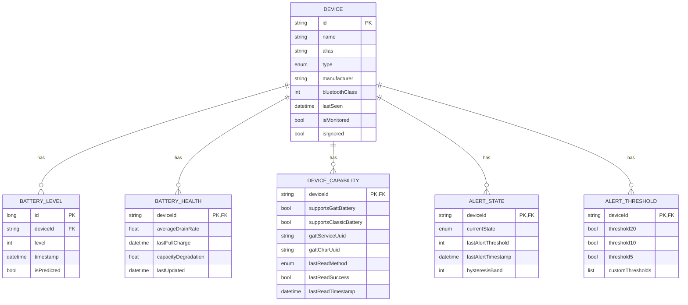
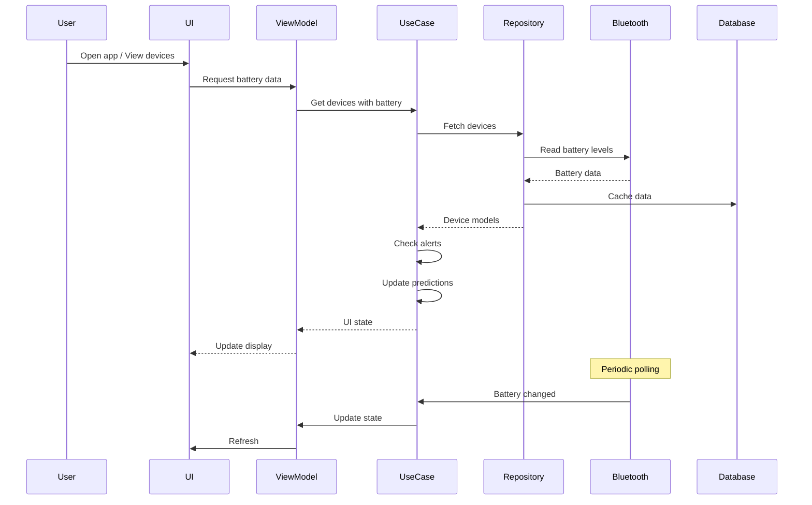

# Battery Guardian - Requirements Specification

**Version:** 1.0.0  
**Last Updated:** August 3, 2026  
**Status:** Draft  
**Author:** Peter Andree

---

## Table of Contents

1. [Document Overview](#1-document-overview)
2. [Product Vision](#2-product-vision)
3. [User Stories](#3-user-stories)
4. [Functional Requirements](#4-functional-requirements)
5. [Non-Functional Requirements](#5-non-functional-requirements)
6. [Technical Requirements](#6-technical-requirements)
7. [Data Model](#7-data-model)
8. [Architecture Overview](#8-architecture-overview)
9. [User Interface Requirements](#9-user-interface-requirements)
10. [External Dependencies](#10-external-dependencies)
11. [Assumptions and Constraints](#11-assumptions-and-constraints)
12. [Glossary](#12-glossary)

---

## 1. Document Overview

### 1.1 Purpose

This document provides a comprehensive specification for the **Battery Guardian** application. It serves as the single source of truth for:

- **Product Owners:** Understanding the feature set and business value
- **Developers:** Implementing the technical solution
- **Sponsors:** Evaluating the project scope and investment
- **Testers:** Defining test cases and validation criteria

### 1.2 Scope

This document describes the requirements for an Android application that monitors, predicts, and alerts users about the battery levels of connected Bluetooth devices. It covers all functional, non-functional, and technical aspects of the system.

### 1.3 Audience

- **Product Managers:** To understand features, priorities, and user needs
- **Software Developers:** To implement the technical solution
- **Quality Assurance:** To develop test plans and cases
- **Technical Writers:** To create user documentation
- **Sponsors/Stakeholders:** To assess project feasibility and value

### 1.4 Document Structure

This document is organized into sections that progress from high-level vision to detailed technical specifications. Each requirement is assigned a unique identifier for traceability.

---

## 2. Product Vision

### 2.1 Problem Statement

Users of Bluetooth devices (headphones, speakers, wearables, etc.) frequently experience unexpected device shutdowns due to depleted batteries. This creates frustration, disrupts workflows, and can lead to missed opportunities or safety issues in critical situations.

Current solutions are limited:
- Most devices only show battery level on the device itself or in their proprietary apps
- No unified solution exists for monitoring all Bluetooth devices simultaneously
- No predictive capabilities to warn users before a device dies
- No historical tracking of battery health and degradation

### 2.2 Solution Overview

**Battery Guardian** is an Android application that:

1. **Monitors** the battery levels of all connected Bluetooth devices in real-time
2. **Predicts** when devices will reach critical battery levels using historical data
3. **Alerts** users with configurable notifications before devices shut down
4. **Tracks** battery health and degradation over time
5. **Operates** reliably in the background, even when the app is closed

### 2.3 Target Users

| User Type | Description | Priority |
|-----------|-------------|----------|
| **Everyday Users** | Individuals who use Bluetooth headphones, speakers, or wearables daily | High |
| **Professionals** | Users who rely on Bluetooth devices for work (calls, meetings, presentations) | High |
| **Gamers** | Users who use Bluetooth controllers, headsets for gaming | Medium |
| **Fitness Enthusiasts** | Users who track workouts with Bluetooth wearables | Medium |
| **Safety-Conscious Users** | Users who need reliable device operation for safety (e.g., hearing aids, medical devices) | High |
| **Tech Enthusiasts** | Users interested in monitoring device health and performance | Medium |

### 2.4 Business Value

- **User Retention:** Solves a common pain point with no existing comprehensive solution
- **Market Differentiation:** Unique combination of monitoring, prediction, and health tracking
- **Platform Potential:** Can expand to iOS and desktop platforms
- **Monetization Opportunities:** Premium features (advanced analytics, multi-device sync)

### 2.5 Success Criteria

| Metric | Target | Measurement Period |
|--------|--------|-------------------|
| Active Users | 10,000 | First 6 months |
| User Retention (30-day) | 70% | Ongoing |
| Average Rating | 4.5/5 | App Store |
| Crash-Free Rate | 99.5% | Ongoing |
| Battery Impact | < 5% per day | Ongoing |

---

## 3. User Stories

### 3.1 Core Functionality

| ID | Title | User Story | Priority | Acceptance Criteria |
|----|-------|------------|----------|---------------------|
| US-001 | View Connected Devices | As a user, I want to see a list of all my connected Bluetooth devices with their current battery levels so I can check their status at a glance. | Must Have | - Device list displays all paired Bluetooth devices<br>- Each device shows name, icon, and battery percentage<br>- Battery level updates in real-time |
| US-002 | Receive Low Battery Alerts | As a user, I want to receive notifications when my device battery is low so I can charge it in time. | Must Have | - Notifications trigger at configurable thresholds (default: 20%, 10%, 5%)<br>- Notifications include device name and battery level<br>- Notifications are clear and actionable |
| US-003 | View Battery History | As a user, I want to see the battery level history for my devices so I can understand usage patterns. | Should Have | - History shows battery level over time (graph)<br>- Can filter by device and time range<br>- Shows charging cycles |
| US-004 | Get Battery Predictions | As a user, I want to know when my device will hit a low battery level so I can plan charging. | Must Have | - Predictions based on current drain rate<br>- Shows time until next milestone (20%, 10%, 5%)<br>- Updates predictions as usage patterns change |
| US-005 | Customize Alert Thresholds | As a user, I want to set custom alert thresholds for each device so I can personalize notifications. | Should Have | - Can set thresholds per device<br>- Can set global default thresholds<br>- Thresholds can be adjusted at any time |
| US-006 | Ignore Specific Devices | As a user, I want to exclude certain devices from monitoring so I only get alerts for devices I care about. | Should Have | - Can add/remove devices from ignore list<br>- Ignored devices don't trigger alerts<br>- Ignored devices still appear in device list |
| US-007 | View Battery Health | As a user, I want to see battery health metrics for my devices so I can identify when to replace them. | Could Have | - Shows battery capacity degradation<br>- Shows average drain rate<br>- Shows time between full charges |

### 3.2 Advanced Features

| ID | Title | User Story | Priority | Acceptance Criteria |
|----|-------|------------|----------|---------------------|
| US-008 | View Charging Status | As a user, I want to see if my device is currently charging so I know when it will be ready. | Should Have | - Shows charging icon when device is charging<br>- Shows charging speed if available<br>- Updates in real-time |
| US-009 | Export Battery Data | As a user, I want to export my battery history data so I can analyze it externally. | Could Have | - Export as CSV or JSON<br>- Can export for single or multiple devices<br>- Can select time range for export |
| US-010 | Multi-Device Alerts | As a user, I want to receive a single notification for multiple low-battery devices so I don't get spammed. | Should Have | - Groups notifications for multiple devices<br>- Can expand to see individual device details<br>- Configurable grouping behavior |
| US-011 | Device Classification | As a user, I want my devices to be automatically classified (headphones, speaker, etc.) so the app can provide relevant information. | Should Have | - Devices are automatically classified by type<br>- Classification affects UI and tips<br>- Can manually override classification |
| US-012 | Optimization Tips | As a user, I want to receive tips on how to extend my device battery life so I can get more usage time. | Could Have | - Shows device-specific tips<br>- Tips based on usage patterns<br>- Can dismiss tips I don't find helpful |

### 3.3 Reliability and Edge Cases

| ID | Title | User Story | Priority | Acceptance Criteria |
|----|-------|------------|----------|---------------------|
| US-013 | Handle Device Disconnections | As a user, I want the app to handle device disconnections gracefully so I don't get false alerts. | Must Have | - App detects when devices disconnect<br>- No alerts for disconnected devices<br>- Reconnects automatically when device is back in range |
| US-014 | Prevent Notification Spam | As a user, I want to avoid getting repeated notifications for the same device so I'm not annoyed. | Must Have | - Implements hysteresis (2% band) for notifications<br>- Only one notification per threshold per device<br>- Notifications clear when battery recovers |
| US-015 | Work in Background | As a user, I want the app to continue monitoring even when closed so I don't miss important alerts. | Must Have | - Monitoring continues in background<br>- Alerts trigger even when app is closed<br>- Minimal battery impact from background operation |
| US-016 | Handle Phone Reboots | As a user, I want the app to restart monitoring after my phone reboots so I don't have to manually restart it. | Must Have | - App automatically restarts after reboot<br>- Monitoring resumes without user intervention<br>- Alerts trigger normally after reboot |
| US-017 | Handle Unreliable Battery Reporting | As a user, I want the app to handle devices that report incorrect battery levels so I get accurate information. | Must Have | - Detects suspicious battery data (no change for long periods)<br>- Uses historical averages when real-time data is unreliable<br>- Flags devices with unreliable reporting |

### 3.4 Accessibility

| ID | Title | User Story | Priority | Acceptance Criteria |
|----|-------|------------|----------|---------------------|
| US-018 | Screen Reader Support | As a visually impaired user, I want the app to be compatible with screen readers so I can use it effectively. | Should Have | - All UI elements have content descriptions<br>- Proper labeling for accessibility services<br>- Logical navigation order |
| US-019 | Color Blind Support | As a color-blind user, I want the app to use more than just color to convey information so I can understand it. | Should Have | - Uses icons in addition to colors<br>- Uses patterns or textures in graphs<br>- Sufficient contrast between elements |

---

## 4. Functional Requirements

### 4.1 Device Management

| ID | Requirement | Description | Priority |
|----|-------------|-------------|----------|
| FR-001 | Device Discovery | The app shall automatically discover all paired Bluetooth devices on the phone. | Must Have |
| FR-002 | Device Connection | The app shall establish connections to Bluetooth devices to read battery levels. | Must Have |
| FR-003 | Device Identification | The app shall identify devices by name, MAC address, and device type. | Must Have |
| FR-004 | Device Classification | The app shall classify devices into categories (headphones, speaker, smartwatch, etc.). | Should Have |
| FR-005 | Device Ignore List | The app shall allow users to ignore specific devices from monitoring and alerts. | Should Have |
| FR-006 | Device Renaming | The app shall allow users to rename devices for easier identification. | Could Have |
| FR-007 | Device Details | The app shall display detailed information about each device (manufacturer, model, connection status). | Should Have |

### 4.2 Battery Monitoring

| ID | Requirement | Description | Priority |
|----|-------------|-------------|----------|
| FR-008 | Battery Level Reading | The app shall read battery levels from connected Bluetooth devices. | Must Have |
| FR-009 | Real-Time Updates | The app shall update battery levels in real-time as they change. | Must Have |
| FR-010 | Multiple Reading Methods | The app shall use multiple methods to read battery levels (GATT, Classic Bluetooth). | Must Have |
| FR-011 | Charging State Detection | The app shall detect if a device is currently charging. | Should Have |
| FR-012 | Connection State Monitoring | The app shall monitor the connection state of each device. | Must Have |
| FR-013 | Battery Level History | The app shall store historical battery level data for each device. | Should Have |

### 4.3 Battery Prediction

| ID | Requirement | Description | Priority |
|----|-------------|-------------|----------|
| FR-014 | Drain Rate Calculation | The app shall calculate the battery drain rate for each device. | Must Have |
| FR-015 | Time-to-Milestone Prediction | The app shall predict when a device will reach configurable battery milestones (20%, 10%, 5%). | Must Have |
| FR-016 | Regression Model | The app shall use linear regression to predict battery drain based on historical data. | Must Have |
| FR-017 | Model Persistence | The app shall persist regression models for each device to avoid recalculating. | Should Have |
| FR-018 | Model Updates | The app shall update regression models as new battery data is collected. | Must Have |
| FR-019 | Edge Case Handling | The app shall handle edge cases in the regression model (no drain, erratic data, charging). | Must Have |

### 4.4 Alert System

| ID | Requirement | Description | Priority |
|----|-------------|-------------|----------|
| FR-020 | Threshold Alerts | The app shall trigger alerts when battery levels cross configurable thresholds. | Must Have |
| FR-021 | Predictive Alerts | The app shall trigger alerts when a device is predicted to reach a threshold within a configurable time. | Should Have |
| FR-022 | Hysteresis | The app shall implement hysteresis to prevent notification spam at threshold boundaries. | Must Have |
| FR-023 | Alert State Tracking | The app shall track the alert state (Normal, Low, High) for each device. | Must Have |
| FR-024 | Notification Grouping | The app shall group notifications for multiple devices to avoid spam. | Should Have |
| FR-025 | Notification Priority | The app shall use appropriate notification priorities based on battery level. | Should Have |
| FR-026 | Do Not Disturb Respect | The app shall respect the user's Do Not Disturb settings. | Must Have |
| FR-027 | Alert Customization | The app shall allow users to customize which alerts they receive. | Should Have |

### 4.5 User Preferences

| ID | Requirement | Description | Priority |
|----|-------------|-------------|----------|
| FR-028 | Global Thresholds | The app shall allow users to set global alert thresholds. | Must Have |
| FR-029 | Per-Device Thresholds | The app shall allow users to set custom thresholds for each device. | Should Have |
| FR-030 | Polling Interval | The app shall allow users to configure the battery polling interval. | Should Have |
| FR-031 | Hysteresis Configuration | The app shall allow users to configure the hysteresis band. | Could Have |
| FR-032 | Notification Settings | The app shall allow users to enable/disable notifications. | Must Have |
| FR-033 | Theme Selection | The app shall allow users to select light or dark theme. | Could Have |

### 4.6 Data Management

| ID | Requirement | Description | Priority |
|----|-------------|-------------|----------|
| FR-034 | Data Persistence | The app shall persist all data locally on the device. | Must Have |
| FR-035 | Data Export | The app shall allow users to export battery history data. | Could Have |
| FR-036 | Data Cleanup | The app shall automatically clean up old data to save space. | Should Have |
| FR-037 | Data Backup | The app shall provide a mechanism for users to backup their data. | Could Have |

---

## 5. Non-Functional Requirements

### 5.1 Performance

| ID | Requirement | Description | Target | Priority |
|----|-------------|-------------|--------|----------|
| NFR-001 | Battery Level Update Latency | Time between battery level change and UI update | < 1 second | Must Have |
| NFR-002 | App Battery Impact | Battery usage by the app itself | < 5% per day | Must Have |
| NFR-003 | Device Polling Interval | Time between battery level checks | Configurable (1-15 min) | Must Have |
| NFR-004 | Concurrent Device Limit | Maximum number of devices monitored simultaneously | 20 | Should Have |
| NFR-005 | Prediction Calculation Time | Time to calculate battery predictions | < 100ms | Must Have |
| NFR-006 | App Launch Time | Time from tap to usable UI | < 2 seconds | Should Have |

### 5.2 Reliability

| ID | Requirement | Description | Target | Priority |
|----|-------------|-------------|--------|----------|
| NFR-007 | Crash-Free Rate | Percentage of sessions without crashes | 99.5% | Must Have |
| NFR-008 | Background Operation | App continues monitoring when in background | 100% | Must Have |
| NFR-009 | Reboot Recovery | App restarts monitoring after phone reboot | 100% | Must Have |
| NFR-010 | Connection Recovery | App reconnects to devices after disconnection | 100% | Must Have |
| NFR-011 | Data Integrity | Battery history data is accurate and complete | 100% | Must Have |

### 5.3 Usability

| ID | Requirement | Description | Target | Priority |
|----|-------------|-------------|--------|----------|
| NFR-012 | Android Version Support | Minimum Android version supported | API 31 (Android 12) | Must Have |
| NFR-013 | Screen Size Support | Supported screen sizes | All standard Android screen sizes | Must Have |
| NFR-014 | Orientation Support | Supported screen orientations | Portrait and Landscape | Should Have |
| NFR-015 | Language Support | Initial language support | English | Must Have |
| NFR-016 | Accessibility Compliance | WCAG 2.1 compliance level | AA | Should Have |

### 5.4 Security

| ID | Requirement | Description | Priority |
|----|-------------|-------------|----------|
| NFR-017 | Data Privacy | All user data remains on the device | Must Have |
| NFR-018 | No Data Transmission | No user data is transmitted to external servers | Must Have |
| NFR-019 | Permission Minimization | Only request necessary permissions | Must Have |
| NFR-020 | Secure Data Storage | Sensitive data is stored securely | Must Have |

### 5.5 Compatibility

| ID | Requirement | Description | Priority |
|----|-------------|-------------|----------|
| NFR-021 | Bluetooth Version Support | Supported Bluetooth versions | 4.0 and later | Must Have |
| NFR-022 | Device Compatibility | Devices supporting Battery Service UUID | Must Have |
| NFR-023 | Fallback Support | Devices without Battery Service UUID | Must Have |

---

## 6. Technical Requirements

### 6.1 Android Permissions

The app requires the following permissions:

| Permission | Purpose | Required | Runtime Request |
|------------|---------|----------|------------------|
| `BLUETOOTH` | Discover and connect to Bluetooth devices | Yes | No |
| `BLUETOOTH_ADMIN` | Access Bluetooth settings | Yes | No |
| `BLUETOOTH_CONNECT` | Connect to paired devices (Android 12+) | Yes | Yes |
| `ACCESS_FINE_LOCATION` | Required for Bluetooth scanning on Android 12+ | Yes | Yes |
| `FOREGROUND_SERVICE` | Run background monitoring service | Yes | No |
| `WAKE_LOCK` | Prevent phone sleep during critical tasks | Yes | No |
| `POST_NOTIFICATIONS` | Send user notifications | Yes | Yes |

### 6.2 Bluetooth UUIDs

The app uses standard Bluetooth SIG UUIDs for battery monitoring:

| UUID | Name | Purpose |
|------|------|---------|
| `0000180f-0000-1000-8000-00805f9b34fb` | Battery Service | Primary service for battery level reading |
| `00002a19-0000-1000-8000-00805f9b34fb` | Battery Level Characteristic | Battery percentage (0-100) |
| `00002bea-0000-1000-8000-00805f9b34fb` | Battery Status Characteristic | Charging state (BT 2.0) |
| `00002a1b-0000-1000-8000-00805f9b34fb` | Battery Power State Characteristic | Charging state (alternative) |

### 6.3 Technical Stack

| Category | Technology | Version |
|----------|------------|---------|
| Language | Kotlin | 2.0.21 |
| SDK | Android SDK | minSdk 31, targetSdk 35 |
| Build System | Gradle | 8.7 |
| UI Framework | Jetpack Compose | Latest stable |
| Architecture | Clean Architecture | Layered (UI → Domain → Data) |
| Dependency Injection | Hilt | 2.55 |
| Database | Room | 2.6.1 |
| Preferences | DataStore | 1.1.1 |
| Async | Kotlin Coroutines | 1.9.0 |
| Testing | JUnit 5, Truth, Turbine, MockK, Robolectric | Latest stable |

### 6.4 Background Operation

The app uses multiple mechanisms to ensure reliable background operation:

1. **Foreground Service**
   - Persistent notification to keep service alive
   - Handles battery monitoring logic
   - Reuses patterns from Workday-Wake's AlarmGuardService

2. **AlarmManager**
   - Used for critical alerts (e.g., 5% battery)
   - Uses `setAlarmClock()` to ensure device wakes up
   - Handles Doze Mode and App Standby

3. **WorkManager**
   - Used for periodic polling
   - Respects battery optimization settings
   - Configurable interval (1, 5, or 15 minutes)

4. **BootCompletedReceiver**
   - Restarts monitoring after device reboot
   - Reuses pattern from Workday-Wake

### 6.5 Battery Optimization

To minimize the app's impact on phone battery:

1. **Battery Optimization Exemption**
   - Requests exemption from Android's battery optimization
   - Allows the app to run in background without restrictions

2. **Adaptive Polling**
   - Longer intervals when no devices are connected
   - Shorter intervals when devices are actively draining

3. **Connection Caching**
   - Reuses BluetoothGatt instances to avoid repeated discovery
   - Reduces Bluetooth radio usage

4. **Efficient Algorithms**
   - Linear regression calculations optimized for mobile
   - Minimal memory footprint

---

## 7. Data Model

### 7.1 Entity Relationship Diagram



### 7.2 Data Entities

#### DeviceEntity

| Field | Type | Description | Nullable | Default |
|-------|------|-------------|----------|---------|
| id | String | Bluetooth MAC address | No | - |
| name | String | User-friendly device name | No | - |
| alias | String | Custom user-assigned name | Yes | null |
| type | DeviceType | Device category (HEADPHONES, SPEAKER, etc.) | No | OTHER |
| manufacturer | String | Device manufacturer | Yes | null |
| bluetoothClass | Int | Bluetooth device class | Yes | null |
| lastSeen | Instant | Last time device was connected | Yes | null |
| isMonitored | Boolean | Whether to monitor this device | No | true |
| isIgnored | Boolean | Whether to ignore this device for alerts | No | false |

#### BatteryLevelEntity

| Field | Type | Description | Nullable | Default |
|-------|------|-------------|----------|---------|
| id | Long | Primary key | No | Auto-generated |
| deviceId | String | Foreign key to DeviceEntity | No | - |
| level | Int | Battery level (0-100) | No | - |
| timestamp | Instant | When the reading was taken | No | - |
| isPredicted | Boolean | Whether this is a real reading or predicted | No | false |

#### BatteryHealthEntity

| Field | Type | Description | Nullable | Default |
|-------|------|-------------|----------|---------|
| deviceId | String | Primary key, foreign key to DeviceEntity | No | - |
| averageDrainRate | Float | Average drain rate in %/hour | Yes | null |
| lastFullCharge | Instant | Timestamp of last full charge | Yes | null |
| capacityDegradation | Float | Battery capacity degradation in % | Yes | null |
| lastUpdated | Instant | When health metrics were last updated | No | - |

#### DeviceCapabilityEntity

| Field | Type | Description | Nullable | Default |
|-------|------|-------------|----------|---------|
| deviceId | String | Primary key, foreign key to DeviceEntity | No | - |
| supportsGattBattery | Boolean | Whether device supports GATT Battery Service | No | false |
| supportsClassicBattery | Boolean | Whether device supports Classic Bluetooth battery | No | false |
| gattServiceUuid | String | UUID of GATT Battery Service | Yes | null |
| gattCharUuid | String | UUID of GATT Battery Level Characteristic | Yes | null |
| lastReadMethod | BatteryReadMethod | Last successful reading method | No | NONE |
| lastReadSuccess | Boolean | Whether last read attempt succeeded | No | false |
| lastReadTimestamp | Instant | When last read was attempted | Yes | null |

#### AlertStateEntity

| Field | Type | Description | Nullable | Default |
|-------|------|-------------|----------|---------|
| deviceId | String | Primary key, foreign key to DeviceEntity | No | - |
| currentState | AlertState | Current alert state (NORMAL, LOW, HIGH) | No | NORMAL |
| lastAlertThreshold | Int | Last threshold that triggered an alert | Yes | null |
| lastAlertTimestamp | Instant | When last alert was triggered | Yes | null |
| hysteresisBand | Int | Hysteresis band in % | No | 2 |

#### AlertThresholdEntity

| Field | Type | Description | Nullable | Default |
|-------|------|-------------|----------|---------|
| deviceId | String | Primary key, foreign key to DeviceEntity | No | - |
| threshold20 | Boolean | Whether to alert at 20% | No | true |
| threshold10 | Boolean | Whether to alert at 10% | No | true |
| threshold5 | Boolean | Whether to alert at 5% | No | true |
| customThresholds | List<Int> | User-defined custom thresholds | Yes | null |

### 7.3 Domain Models

#### Device

```kotlin
data class Device(
    val id: String,
    val name: String,
    val alias: String?,
    val type: DeviceType,
    val manufacturer: String?,
    val bluetoothClass: Int?,
    val lastSeen: Instant?,
    val currentBatteryLevel: Int?,
    val isCharging: Boolean?,
    val isConnected: Boolean,
    val isMonitored: Boolean,
    val isIgnored: Boolean,
    val batteryHealth: BatteryHealth?
)

enum class DeviceType {
    HEADPHONES,
    SPEAKER,
    SMARTWATCH,
    KEYBOARD,
    MOUSE,
    GAME_CONTROLLER,
    HEARING_AID,
    MEDICAL_DEVICE,
    OTHER
}
```

#### BatteryHealth

```kotlin
data class BatteryHealth(
    val averageDrainRate: Float,         // %/hour
    val predictedTimeTo20: Duration?,    // Time until 20% battery
    val predictedTimeTo10: Duration?,    // Time until 10% battery
    val predictedTimeTo5: Duration?,     // Time until 5% battery
    val capacityDegradation: Float?,     // % degradation from original
    val lastFullCharge: Instant?
)
```

#### BatteryPrediction

```kotlin
data class BatteryPrediction(
    val milestone: Int,                  // e.g., 20
    val estimatedTime: Instant,          // When the milestone will be reached
    val confidence: Float                // 0-1 (how confident we are)
)
```

#### AlertState

```kotlin
enum class AlertState {
    NORMAL,
    LOW,
    HIGH
}

sealed class AlertEvent {
    data class LowBattery(
        val deviceId: String,
        val currentLevel: Int,
        val threshold: Int
    ) : AlertEvent()
    
    data class Prediction(
        val deviceId: String,
        val milestone: Int,
        val estimatedTime: Instant
    ) : AlertEvent()
    
    data class HealthWarning(
        val deviceId: String,
        val issue: HealthIssue
    ) : AlertEvent()
}

enum class HealthIssue {
    HIGH_DEGRADATION,
    RAPID_DRAIN,
    NO_CHARGE_DETECTED
}
```

---

## 8. Architecture Overview

### 8.1 Layered Architecture

Battery Guardian follows a **clean, layered architecture** with unidirectional dependencies:

```
┌─────────────────────────────────────────────────────────────┐
│                         UI Layer                                │
│   (Jetpack Compose, ViewModels, Screens)                       │
├─────────────────────────────────────────────────────────────┤
│                         Domain Layer                            │
│   (Use Cases, Models, Repository Interfaces)                   │
├─────────────────────────────────────────────────────────────┤
│                         Data Layer                              │
│   (Repository Implementations, Room, DataStore, Bluetooth)     │
├─────────────────────────────────────────────────────────────┤
│                       Platform Layer                            │
│   (Bluetooth API, Services, Receivers, Scheduling)            │
└─────────────────────────────────────────────────────────────┘
```

### 8.2 Layering Rules

1. **UI Layer**
   - Contains only UI-related code
   - Depends on Domain Layer
   - Never depends on Data Layer or Platform Layer directly
   - Uses Jetpack Compose for UI

2. **Domain Layer**
   - Contains pure Kotlin code (no Android dependencies)
   - Defines business entities and logic
   - Never depends on other layers
   - Can be tested without Android runtime

3. **Data Layer**
   - Implements Domain Layer interfaces
   - Manages data persistence and access
   - Depends on Domain Layer (interfaces) and Platform Layer (Android APIs)

4. **Platform Layer**
   - Contains Android-specific code
   - Handles Bluetooth communication
   - Manages background services and scheduling
   - Depends on Data Layer for persistence

### 8.3 Component Diagram

```mermaid
componentDiagram
    component "UI Layer" {
        component "Screens"
        component "ViewModels"
        component "Composable Functions"
    }
    
    component "Domain Layer" {
        component "Use Cases"
        component "Models"
        component "Repository Interfaces"
    }
    
    component "Data Layer" {
        component "Repository Implementations"
        component "Room Database"
        component "DataStore"
        component "Bluetooth Readers"
    }
    
    component "Platform Layer" {
        component "Bluetooth API"
        component "Foreground Service"
        component "Broadcast Receivers"
        component "AlarmManager"
        component "WorkManager"
    }
    
    "UI Layer" --> "Domain Layer" : depends on
    "Domain Layer" --> "Data Layer" : depends on
    "Data Layer" --> "Platform Layer" : depends on
```

### 8.4 Key Components

#### Monitoring System

```
┌─────────────────────────────────────────────────────────────┐
│                    BatteryMonitorService                       │
│                      (Foreground Service)                       │
├─────────────────────────────────────────────────────────────┤
│                                                             │
│  ┌─────────────────┐  ┌─────────────────┐                   │
│  │  GattBatteryReader │  │ClassicBatteryReader│                   │
│  │  - BluetoothGatt  │  │ - BroadcastReceiver │                   │
│  │  - Connection Cache│  │ - EXTRA_BATTERY_LEVEL│                   │
│  │  - Semaphore      │  │                    │                   │
│  └─────────────────┘  └─────────────────┘                   │
│                              │                                        │
│                              ▼                                        │
│  ┌─────────────────────────────────────────────────────┐    │
│  │               BatteryPredictionEngine                   │    │
│  │  - Linear Regression Model                            │    │
│  │  - Per-device models                                  │    │
│  │  - Slope/Intercept calculations                       │    │
│  └─────────────────────────────────────────────────────┘    │
│                                                             │
│  ┌─────────────────────────────────────────────────────┐    │
│  │                     AlertManager                         │    │
│  │  - Hysteresis (2% band)                               │    │
│  │  - State Machine (Normal/Low/High)                    │    │
│  │  - Notification Dispatcher                            │    │
│  └─────────────────────────────────────────────────────┘    │
│                                                             │
│  ┌─────────────────────────────────────────────────────┐    │
│  │                 PollingOrchestrator                      │    │
│  │  - Configurable interval (1/5/15 min)                 │    │
│  │  - On-demand scans                                     │    │
│  │  - Background scheduling                               │    │
│  └─────────────────────────────────────────────────────┘    │
│                                                             │
└─────────────────────────────────────────────────────────────┘
```

#### Data Flow



---

## 9. User Interface Requirements

### 9.1 Screen Definitions

#### 9.1.1 Main Screen (Device List)

**Purpose:** Display all monitored Bluetooth devices and their battery status.

**Components:**
- Device list with battery level indicators
- Quick actions (refresh, add device)
- Summary of devices with low battery
- Navigation to device details and settings

**Data Displayed:**
- Device name and icon
- Current battery level (percentage)
- Battery level trend (rising/falling/charging)
- Time until next milestone (if applicable)
- Connection status

#### 9.1.2 Device Detail Screen

**Purpose:** Show detailed information about a specific device.

**Components:**
- Device information (name, type, manufacturer)
- Current battery level with large display
- Battery history graph
- Battery health metrics
- Prediction details
- Alert settings for this device

**Data Displayed:**
- Current battery level
- Charging status
- Battery history (last 24 hours, 7 days, 30 days)
- Average drain rate
- Time between full charges
- Capacity degradation
- Predicted time to next milestone

#### 9.1.3 Settings Screen

**Purpose:** Allow users to configure app behavior.

**Sections:**
- **Monitoring Settings**
  - Polling interval (1, 5, 15 minutes)
  - Enable/disable background monitoring
  
- **Alert Settings**
  - Global thresholds (20%, 10%, 5%)
  - Hysteresis band (1-5%)
  - Notification priority
  - Notification sound/vibration
  
- **Device Settings**
  - Per-device thresholds
  - Ignored devices list
  - Device renaming
  
- **Appearance**
  - Dark/light theme
  - Battery display format
  
- **About**
  - App version
  - Privacy policy
  - Open source licenses

#### 9.1.4 Notification Display

**Purpose:** Inform users about battery status changes.

**Components:**
- Device name
- Current battery level
- Alert type (Low Battery, Prediction, etc.)
- Time until milestone (for predictions)
- Actions (Open app, Dismiss)

**Priority Levels:**
- **High (Urgent):** ≤ 5% battery
- **High:** ≤ 10% battery
- **Default:** ≤ 20% battery, predictions

### 9.2 UI Design Principles

1. **Clarity:** Information is easy to understand at a glance
2. **Consistency:** Uniform design language throughout the app
3. **Accessibility:** WCAG 2.1 AA compliance
4. **Performance:** Smooth 60fps animations and transitions
5. **Responsiveness:** Works on all screen sizes and orientations

### 9.3 Design System

- **Color Scheme:** Material Design 3 with dynamic theming
- **Typography:** Material Typography
- **Icons:** Material Icons
- **Spacing:** 8dp grid system
- **Components:** Jetpack Compose Material components

---

## 10. External Dependencies

### 10.1 Android Libraries

| Library | Purpose | Version | License |
|---------|---------|---------|---------|
| Kotlin | Programming language | 2.0.21 | Apache 2.0 |
| AndroidX Core | Core Android functionality | Latest stable | Apache 2.0 |
| Jetpack Compose | UI framework | Latest stable | Apache 2.0 |
| Compose Material | Material Design components | Latest stable | Apache 2.0 |
| Compose Navigation | Navigation between screens | Latest stable | Apache 2.0 |
| Hilt | Dependency injection | 2.55 | Apache 2.0 |
| Room | SQLite database | 2.6.1 | Apache 2.0 |
| DataStore | Preferences storage | 1.1.1 | Apache 2.0 |
| Lifecycle | Lifecycle-aware components | Latest stable | Apache 2.0 |
| Coroutines | Asynchronous programming | 1.9.0 | Apache 2.0 |
| JUnit | Unit testing | 5.x | Eclipse Public License 1.0 |
| Truth | Assertion library | Latest stable | Apache 2.0 |
| Turbine | Flow testing | Latest stable | MIT |
| MockK | Mocking library | Latest stable | Apache 2.0 |
| Robolectric | Instrumentation testing | Latest stable | MIT |

### 10.2 Build Tools

| Tool | Version | License |
|------|---------|---------|
| Gradle | 8.7 | Apache 2.0 |
| Android Gradle Plugin | 8.4.0 | Apache 2.0 |
| Kotlin Gradle Plugin | 2.0.21 | Apache 2.0 |
| KSP | Latest stable | Apache 2.0 |

---

## 11. Assumptions and Constraints

### 11.1 Assumptions

| ID | Assumption | Impact if False |
|----|------------|-----------------|
| AS-001 | Most Bluetooth devices support Battery Service UUID (0x180F) | Fallback to Classic Bluetooth may not work for all devices |
| AS-002 | Users have at least one Bluetooth device | App provides limited value without devices |
| AS-003 | Android Bluetooth API is stable across versions | May need version-specific workarounds |
| AS-004 | Users keep Bluetooth enabled on their phones | App cannot function without Bluetooth |
| AS-005 | Linear regression provides sufficient prediction accuracy | More complex models may be needed |

### 11.2 Constraints

| ID | Constraint | Impact |
|----|------------|--------|
| CN-001 | Android API 31+ required | Limits supported devices |
| CN-002 | No iOS support initially | Limits market reach |
| CN-003 | No cloud backend | All data stored locally, no sync across devices |
| CN-004 | No LLM/AI models | Predictions use simple regression only |
| CN-005 | Battery optimization required | App may be killed by system without exemption |

---

## 12. Glossary

| Term | Definition |
|------|------------|
| **BLE** | Bluetooth Low Energy - A power-efficient Bluetooth technology |
| **GATT** | Generic Attribute Profile - Protocol for Bluetooth communication |
| **UUID** | Universally Unique Identifier - Standardized identifiers for Bluetooth services |
| **Hysteresis** | A technique to prevent rapid toggling between states by using a dead band |
| **Foreground Service** | An Android service that displays a persistent notification |
| **Doze Mode** | Android power-saving mode that restricts background operations |
| **App Standby** | Android feature that defers background operations for idle apps |
| **Room** | SQLite object mapper for Android |
| **DataStore** | Data storage solution for preferences |
| **Coroutines** | Kotlin's asynchronous programming model |
| **Flow** | Kotlin cold asynchronous stream |
| **StateFlow** | Kotlin hot asynchronous state holder |

---

## Appendix A: Prediction Algorithm Details

### A.1 Linear Regression Model

The prediction engine uses ordinary least squares linear regression to model battery drain:

Given a set of observations `(x_i, y_i)` where:
- `x_i` = timestamp (in hours since epoch)
- `y_i` = battery level (0-100)

The model parameters are calculated as:

```
n = number of observations
sum_x = Σx_i
sum_y = Σy_i
sum_xy = Σ(x_i * y_i)
sum_x2 = Σ(x_i^2)

slope = (n * sum_xy - sum_x * sum_y) / (n * sum_x2 - sum_x^2)
intercept = (sum_y - slope * sum_x) / n
```

The prediction for a milestone `m` is:

```
time_to_milestone = (m - intercept) / slope
```

### A.2 Confidence Calculation

Confidence in predictions is calculated based on:
1. Number of data points (more = higher confidence)
2. Time since last observation (recent = higher confidence)
3. Variance in observations (consistent = higher confidence)

```kotlin
fun calculateConfidence(
    dataPoints: Int,
    timeSinceLastObservation: Duration,
    variance: Float
): Float {
    var confidence = 0.0f
    
    // More data points = higher confidence (capped at 20)
    confidence += minOf(dataPoints.toFloat() / 20, 0.4f)
    
    // More recent data = higher confidence (capped at 1 hour)
    val hoursSinceLast = timeSinceLastObservation.inWholeHours.toFloat()
    confidence += maxOf(0f, 1f - hoursSinceLast / 24) * 0.3f
    
    // Lower variance = higher confidence
    confidence += maxOf(0f, 1f - variance) * 0.3f
    
    return minOf(confidence, 1.0f)
}
```

### A.3 Edge Case Handling

| Scenario | Detection | Handling |
|----------|-----------|----------|
| Device not in use | slope ≈ 0 for extended period | Disable predictions, show "Device not in use" |
| Device charging | slope > 0 | Predict time to full, not milestones |
| Erratic data | High variance in observations | Use moving average, reduce confidence |
| Insufficient data | < 3 observations | Use device-specific defaults |
| Outliers | Observation deviates > 2σ from mean | Exclude from calculation |

---

## Appendix B: Bluetooth Battery Reading Methods

### B.1 GATT Battery Service

**Service UUID:** `0000180f-0000-1000-8000-00805f9b34fb`  
**Characteristic UUID:** `00002a19-0000-1000-8000-00805f9b34fb`

**Reading Process:**
1. Discover device with Battery Service UUID
2. Connect to device using `BluetoothGatt`
3. Discover Battery Service
4. Discover Battery Level Characteristic
5. Read characteristic value (1 byte, 0-100)
6. Optionally read Battery Status Characteristic for charging state

**Limitations:**
- Only works for BLE devices
- Requires device to support Battery Service
- Connection overhead for each device

### B.2 Classic Bluetooth

**Broadcast:** `BluetoothDevice.ACTION_BATTERY_LEVEL_CHANGED`  
**Extra:** `BluetoothDevice.EXTRA_BATTERY_LEVEL` (int, 0-100)

**Reading Process:**
1. Register `BroadcastReceiver` for battery level changes
2. Wait for system to broadcast battery level updates
3. Extract battery level from intent extras

**Limitations:**
- Only works for some Classic Bluetooth devices
- Battery level updates may be infrequent
- Requires device to report battery level to system

### B.3 Manufacturer-Specific Methods

Some manufacturers provide proprietary methods for reading battery levels:

| Manufacturer | Method | Notes |
|--------------|--------|-------|
| Apple (AirPods) | Undocumented GATT characteristics | Requires reverse engineering |
| Sony | Proprietary service UUIDs | Varies by model |
| Bose | Proprietary service UUIDs | Varies by model |
| Others | Varies | Research required |

---

## Appendix C: Notification Priority Matrix

| Battery Level | Notification Priority | Can Bypass DND? | Sound | Vibration |
|---------------|---------------------|-----------------|-------|-----------|
| ≤ 5% | High (Urgent) | Yes | Yes | Yes |
| ≤ 10% | High | No | Yes | Yes |
| ≤ 20% | Default | No | Yes | Yes |
| Prediction (≤ 30 min to 20%) | Default | No | Yes | Yes |
| Prediction (≤ 1 hour to 20%) | Low | No | No | Yes |
| Health Warning | Default | No | Yes | Yes |
| Connection Restored | Low | No | No | No |

---

## Document History

| Version | Date | Author | Changes |
|---------|------|--------|---------|
| 1.0.0 | 2026-08-03 | Peter Andree | Initial version |
